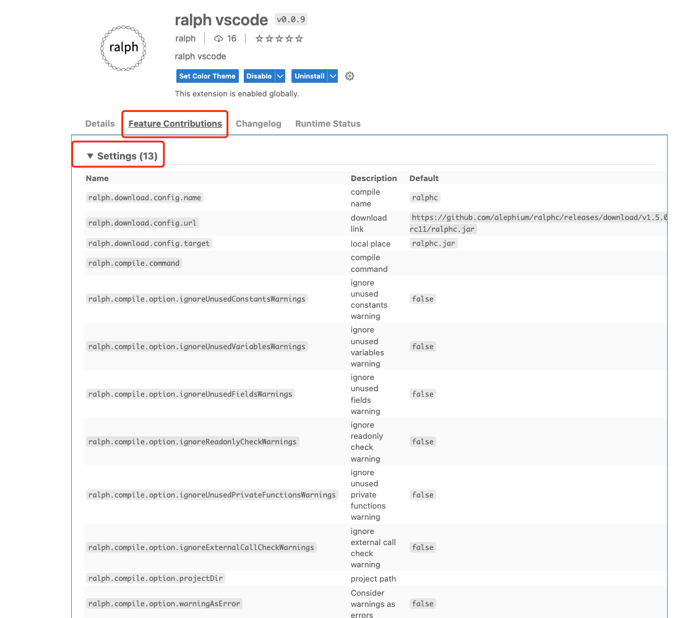
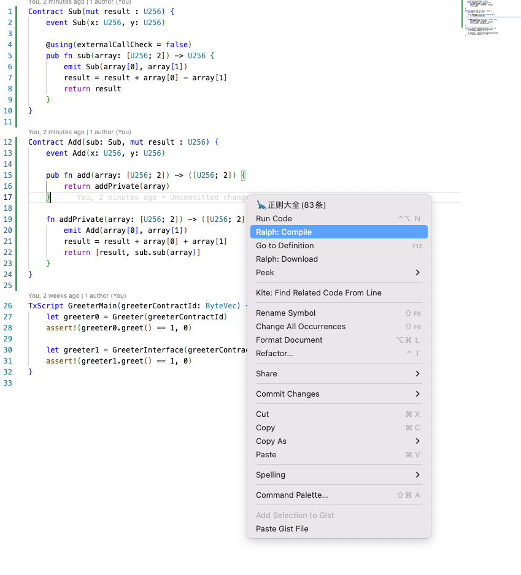
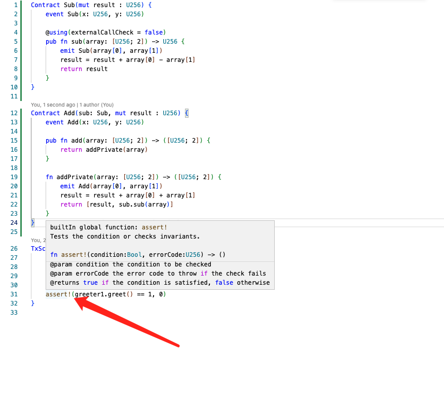
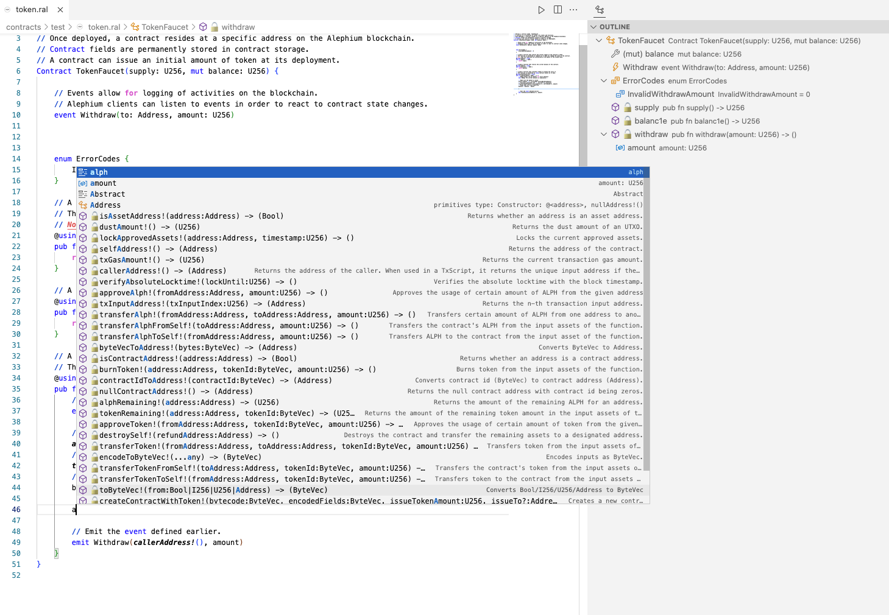
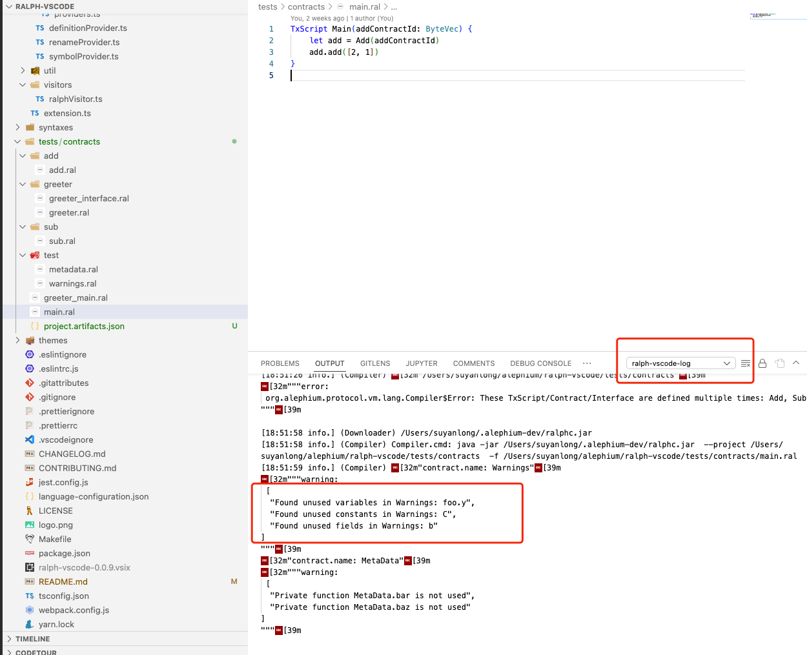

# Ralph Language for VS Code

## Overview

Ralph is the language used in alephium to write smart contracts.

## Features

- Friendly theme setting ✅
- Highlighting ✅
- Snippet ✅
- Formatting ✅（simple format）
- Compile ✅ ( ctl[cmd] + shift + p => Ralph: compile )
- IntelliSense ✅
  - Provide a hover for the given code position. ✅
  - Document symbol provider. ✅
  - Rename Symbol. ✅
  - Symbol completion. ✅
  - Find All symbol. ✅
  - Go to symbol. ✅
  - Peek symbol. ✅
  - ...
- Linting. ✅

## Install ralph-lsp

Download `ralph-lsp-x.x.x.zip` from [the latest release page](https://github.com/alephium/ralph-lsp/releases/latest).
Unzip and add the `bin` directory to your `PATH`.
You might need to [start vscode from the terminal](https://code.visualstudio.com/docs/supporting/faq#_resolving-shell-environment-fails), so it can pick up the `PATH` environment variable.

## Build the extension

```bash
npm install
npm run compile
vsce package
```

## Install the extension

Go to vscode extensions and click on the three dots on the top right corner and select `Install from VSIX...` and select the generated `.vsix` file.

## Extension Settings

### Configuration



## Guide

### Compile



### Hover



### Outline


### Completion



### Log output



#### More command compile

https://github.com/alephium/alephium

## FAQ

<https://github.com/alephium/ralph-vscode/issues>

## References

<https://github.com/alephium>
