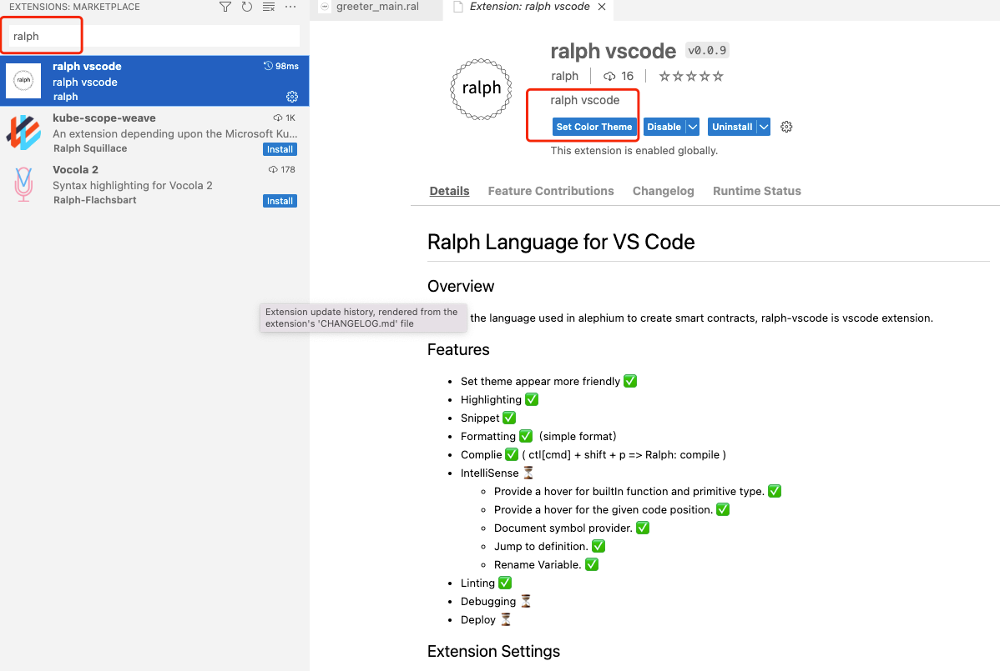

# Ralph Language for VS Code

## Overview

Ralph is the language used in alephium to write smart contracts.

## Features

- Friendly theme setting ✅
- Highlighting ✅
- Snippet ✅
- Formatting ✅（simple format）
- Compile ✅ ( ctl[cmd] + shift + p => Ralph: compile )
- IntelliSense ✅
  - Provide a hover for the given code position. ✅
  - Document symbol provider. ✅
  - Rename Symbol. ✅
  - Symbol completion. ✅
  - Find All symbol. ✅
  - Go to symbol. ✅
  - Peek symbol. ✅
  - ...
- Linting. ✅

## Extension Settings

### Theme

### Configuration

## Guide

### Compile

### Hover

### Outline

### Completion

### Log output

#### More command compile

https://github.com/alephium/alephium

## FAQ

<https://github.com/alephium/ralph-vscode/issues>

## References

<https://github.com/alephium>
